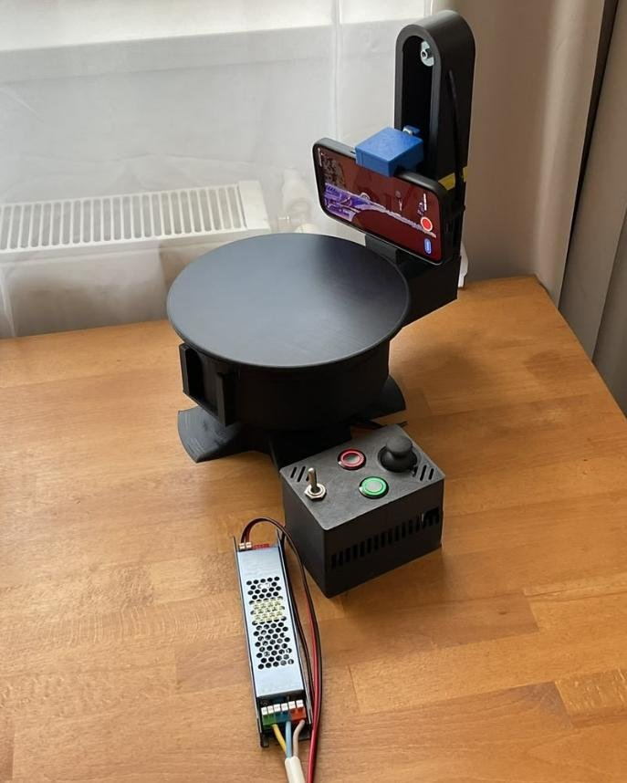
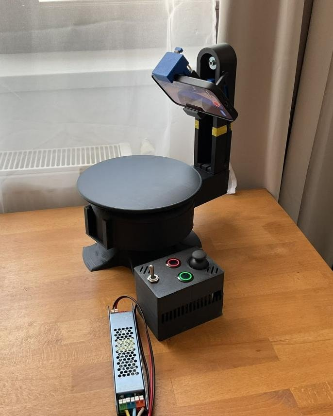
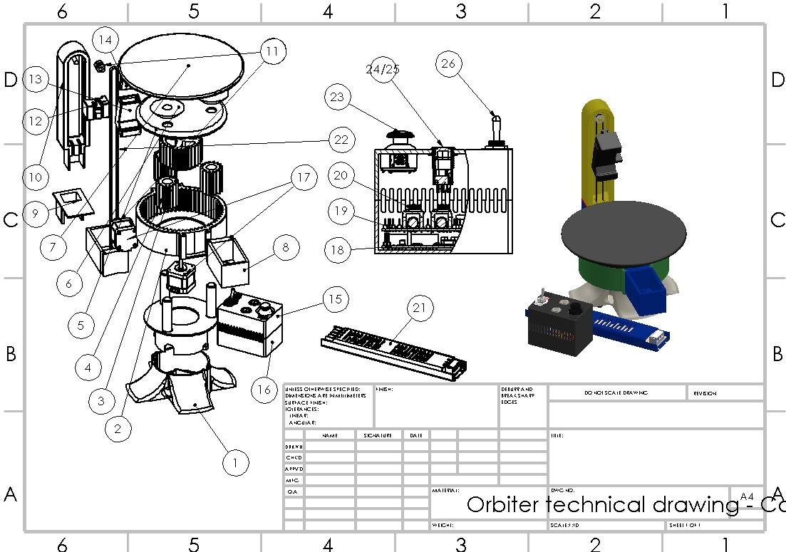
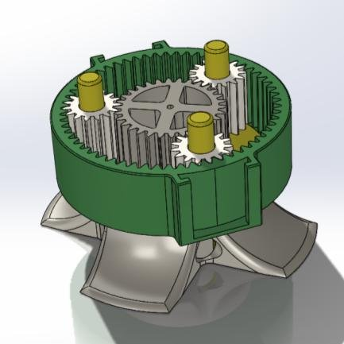
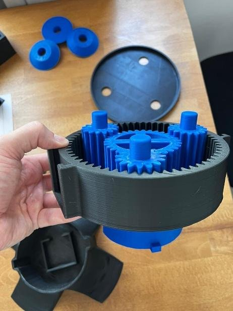
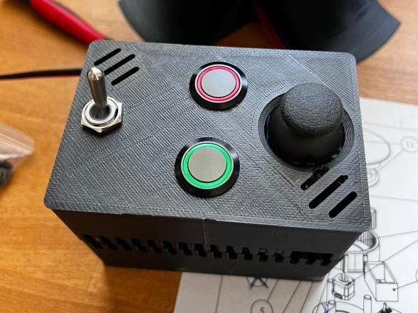
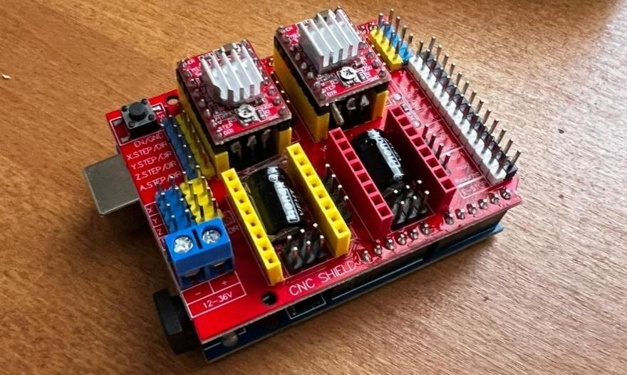
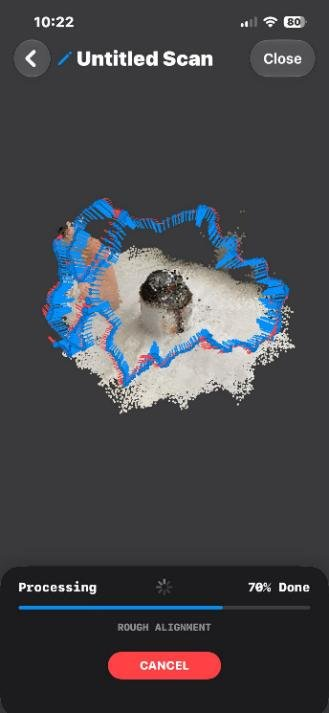
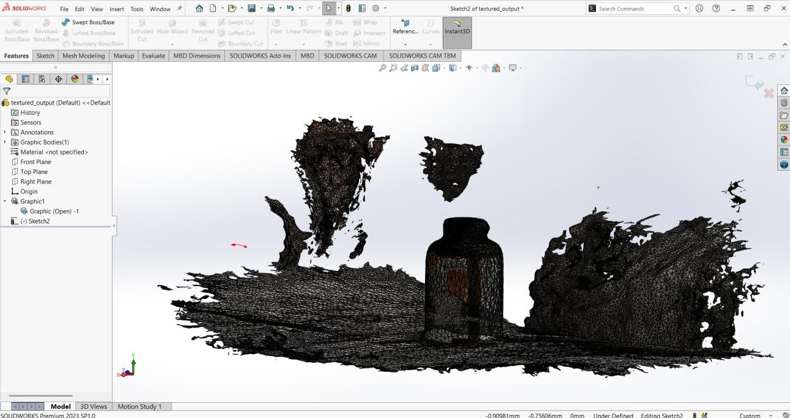

# OrbiScan — Low-Cost Automated 3D Scanner

**A 2-axis motorized rig that turns any smartphone into an automated photogrammetry scanner for reverse engineering.**
Designed, 3D-printed, wired and programmed from scratch as my Bachelor's thesis in Industrial Engineering at the National University of Science and Technology POLITEHNICA Bucharest (graded **10/10**).

<p align="center">
  
  &nbsp;
  
</p>

| | |
|---|---|
| **Hardware cost** | ~76 € electronics + ~12 € PLA (≈ 1 spool, 946 g of printed parts) |
| **Axes** | Azimuth rotation (planetary gearbox, 2:1) + vertical lift (GT2 belt, 130 mm travel) |
| **Scan cycle** | 8 sectors around the object, ~2 minutes per automated cycle |
| **Controller** | Arduino Uno + CNC Shield V3, bare-metal non-blocking C++ |
| **Sensor** | The user's own smartphone (60–95 mm wide), any photogrammetry / LiDAR scanning app |

---

## Why

Professional 3D scanners (laser, structured light) cost thousands of euros, while phone-only scanning apps depend on a steady hand and usually produce incomplete or distorted meshes. A survey of 47 engineering students and makers confirmed the gap: most need to digitize physical parts, own a capable phone, and would pay under 100 € for a DIY kit that automates the camera motion.

OrbiScan solves the motion part: the object sits still on the platform while the arm orbits it and sweeps the phone vertically, giving the scanning app consistent, overlapping, blur-free views.

## How it works

<p align="center">
  
</p>

**Mechanics**
- **Azimuth axis:** a NEMA 17 drives a fully 3D-printed planetary gearbox (sun, 3 planets, ring gear) that rotates the arm around the object. Printed with 0.2 mm clearances, it runs **without any metal bearings**.
- **Vertical axis:** a second NEMA 17 moves the phone carriage along the tower through a GT2 timing belt (20-tooth pulley, 1/32 microstepping → 160 steps/mm).
- **Passive cam slot:** as the carriage climbs, a cam follower tilts the phone, so it sees both the sides and the top of the object without a third motor.
- **Phone clamp:** universal clamp for phones 60–95 mm wide.

<p align="center">
  
  &nbsp;
  
</p>

**Electronics**
- Arduino Uno (Plusivo R3) + CNC Shield V3
- Base axis: A4988 driver, full step · Tower axis: DRV8825 driver, 1/32 microstepping
- 12 V / 60 W PSU wired directly to the shield, isolating the 5 V logic from motor noise
- Control panel: analog XY joystick, green START button, red HOME/OVERRIDE button, main power toggle

<p align="center">
  
  &nbsp;
  
</p>

## Firmware

[`orbiscan.ino`](orbiscan.ino) is written from scratch in C++, without AccelStepper or other blocking libraries, so both motors and the inputs are handled at the same time.

- **State machine:** STANDBY ⇄ MANUAL (joystick button, 500 ms debounce) and an AUTO sequence started by the green button.
- **Non-blocking motion:** step timing is driven by `micros()` instead of `delay()`, so the joystick can move both axes simultaneously and smoothly.
- **Automated cycle:** for each of the 8 sectors the carriage rises to the top, then descends while the base rotates to the next sector. The two motions are interpolated concurrently, which cuts the cycle time compared with moving the axes one after another.
- **Dead-reckoning position tracking:** the open-loop system has no endstops, so every step is counted in `pozitieX` / `pozitieY` to always know where home is.
- **Safety override:** the red button is checked inside every motion loop. It aborts the cycle and homes the machine, always lowering the tower first and rotating the base second to avoid collisions.

### Pinout (CNC Shield V3)

| Function | Pin |
|---|---|
| Base (X) STEP / DIR | D2 / D5 |
| Tower (Y) STEP / DIR | D3 / D6 |
| Drivers enable | D8 |
| Joystick X / Y | A5 / A4 |
| Joystick button (Manual ⇄ Standby) | A0 |
| Green button (Start auto scan) | A1 |
| Red button (Override / Home) | A2 |

### Calibration

```cpp
const long PASI_370_GRADE = 411;   // base: 200 steps/rev × 2:1 reduction → ~370° (10° overlap)
const long PASI_CURSA_Y  = 20800;  // tower travel in steps = travel_mm × 160 (here 130 mm)
const int  NUMAR_POZITII = 8;      // number of scanning sectors
```

### Build & run
1. Print the parts in PLA (structural gears at 20% cubic infill with extra perimeters; housings at 5–10%).
2. Seat the drivers on the CNC Shield with the EN pins aligned (a reversed A4988 shorts VMOT to logic), then set VREF.
3. Flash `orbiscan.ino` with the Arduino IDE (Serial Monitor at 9600 baud shows the current mode).
4. Mount the phone, start a capture in your scanning app, press the green button.

## Testing and validation

Before the scanning tests I ran an **FMEA**, an **Ishikawa** root-cause analysis and a **Pareto** prioritization. They showed that motor vibration (ghosting) and structural deflection of the arm caused about 75% of scan defects. The fixes were microstepping, TPU dampening feet, a stiffer curved arm and adjustable belt anchors.

The validation scan used a deliberately difficult object: a cylindrical bottle with glossy plastic and matte printed text. The point cloud aligned without tracking failures, and the mesh came out cohesive with minimal warping. It imported cleanly into SolidWorks for inspection.

<p align="center">
  
  &nbsp;
  
</p>

## Next steps
- Bluetooth link to a phone app to trigger captures automatically at each sector
- Endstops for absolute homing instead of dead reckoning
- Closed-loop accuracy measurement against reference parts (target: < 1 mm deviation)

## Author
**Filip-Matei Avram** · Industrial Engineer, MSc Industrial Engineering & Robotics (in progress), Politehnica Bucharest
[LinkedIn](https://www.linkedin.com/in/filip-matei-avram)
